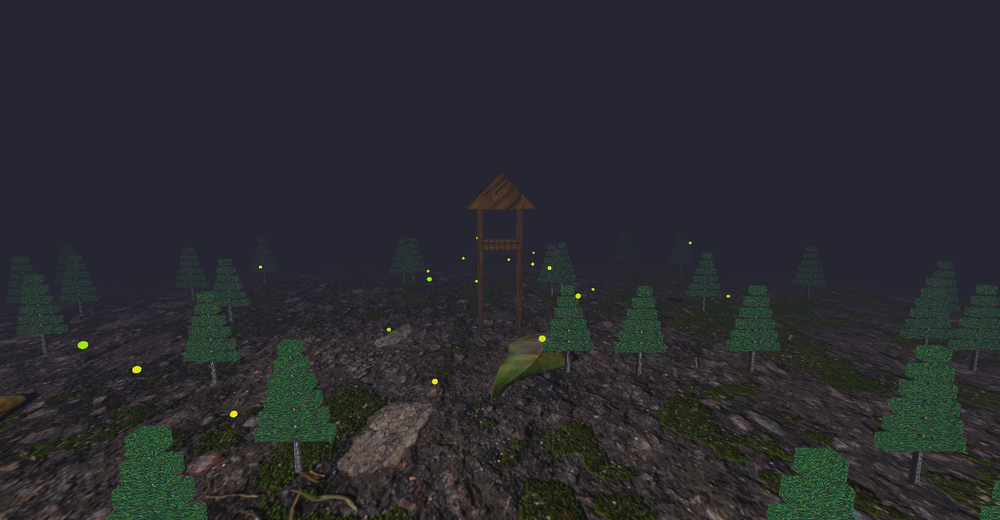
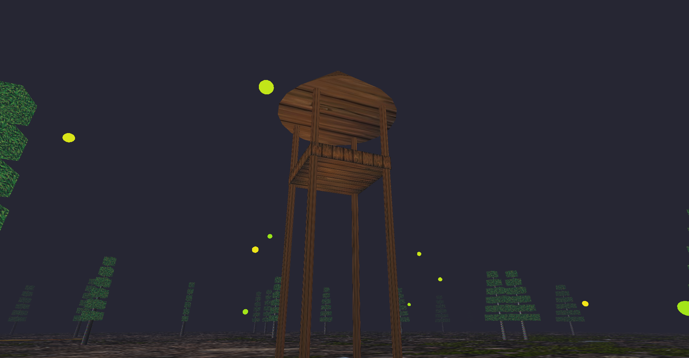
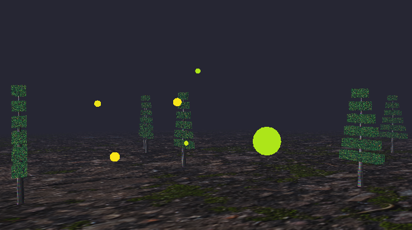

# Firefly Forest

## Project Overview

This project implements a 3D virtual environment depicting a night-time forest scene. The application demonstrates fundamental computer graphics concepts by combining procedural generation, complex geometric modeling, and atmospheric effects to create an immersive visual experience.

The scene features a generated forest of animated pine trees, a central watchtower structure, and a dynamic particle system representing fireflies, all rendered with depth-enhancing volumetric fog.



---

## Key Features

### 1. Procedural Forest Generation
The environment is populated by procedurally placed pine trees using a randomized distribution algorithm. The system ensures natural placement while actively preventing objects from overlapping with the central watchtower area. The terrain utilizes texture wrapping to simulate an infinite ground plane.

### 2. Dynamic Wind Simulation
The scene is not static; the vegetation comes alive through a physics-based wind simulation. The tree foliage sways rhythmically using mathematical functions applied in real-time. The deformation intensity varies based on height—branches at the top move significantly more than those at the base—creating a realistic sense of weight and flexibility.


### 3. The Watchtower
A complex, manually assembled structure serves as the scene's centerpiece. Constructed from basic geometric primitives (cylinders for support beams, cubes for the platform, and a cone for the roof), it demonstrates hierarchical modeling and precise object positioning.



### 4. Firefly Particle System
To enhance the night-time atmosphere, the scene includes autonomous firefly entities. These particles follow independent orbital paths around the environment, combining circular horizontal movement with vertical oscillation to mimic natural insect flight patterns. They are rendered with specific material properties to appear emissive, glowing through the fog.



### 5. Atmospheric Fog
A volumetric fog effect is applied globally to the scene. This provides depth cues by fading distant objects into the background color, establishing the scale of the environment and cohesive visual mood.

---

## Technical Implementation Details

### Vertex Displacement Animation
The wind effect is not a pre-baked animation but a real-time vertex manipulation performed in the Vertex Shader. The logic relies on a height-dependent sine wave function:

* **Logic:** Vertices with a higher Y-coordinate (top of the tree) receive a larger displacement offset than those at the base.
* **Formula:** `offset = sin(Time * Frequency + Height) * BendStrength * HeightFactor`
* **Result:** This ensures the trunk stays rooted to the ground while the canopy sways naturally.

### Particle Kinematics
The firefly movement is governed by parametric equations computed on the CPU each frame. The movement combines orbital mechanics with vertical oscillation to simulate organic flight:

```cpp
// Polar to Cartesian conversion for orbit
float x = center.x + sin(angle) * radius;
float z = center.z + cos(angle) * radius;

// Vertical oscillation (Sine wave on Y-axis)
float y = center.y + base_height + sin(angle * 2.0f) * 0.5f;
```

### Rendering Pipeline & Optimization
* **Fog Rendering:** Implemented in the Fragment Shader using linear interpolation (`mix`). The fog factor is calculated based on the distance from the camera to the fragment, clamped between 0 and 1.
* **Emissive Materials:** To make fireflies glow, their rendering logic bypasses the standard lighting/fog darkening. The fog calculation for these objects uses a modified distance parameter, ensuring they remain bright even at a distance.
* **Mipmapping:** To prevent aliasing artifacts on the textured ground and tree bark, trilinear filtering (`GL_LINEAR_MIPMAP_LINEAR`) is utilized, ensuring textures remain smooth at grazing angles.

---

## User Controls

The application features a free-fly camera system allowing full navigation of the 3D space.

| Input | Action |
| :--- | :--- |
| **W / A / S / D** | Move Camera (Forward, Left, Backward, Right) |
| **Q / E** | Adjust Altitude (Up / Down) |
| **Mouse + Right Click** | Rotate View (Look Around) |
| **F** | Toggle Fog Effect ON/OFF |